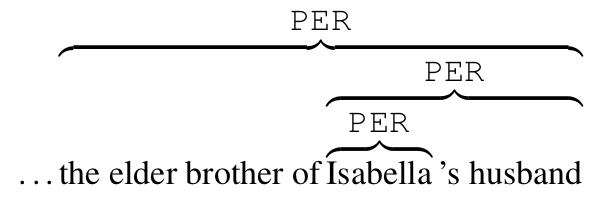

# BookNLP

BookNLP is a natural language processing pipeline that scales to books and other long documents (in English), including:

* Part-of-speech tagging
* Dependency parsing
* Entity recognition
* Character name clustering (e.g., "Tom", "Tom Sawyer", "Mr. Sawyer", "Thomas Sawyer" -> TOM_SAWYER) and coreference resolution
* Quotation speaker identification
* Supersense tagging (e.g., "animal", "artifact", "body", "cognition", etc.)
* Event tagging
* Referential gender inference (TOM_SAWYER -> he/him/his)

BookNLP ships with two models, both with identical architectures but different underlying BERT sizes.  The larger and more accurate `big` model is fit for GPUs and multi-core computers; the faster `small` model is more appropriate for personal computers.  See the table below for a comparison of the difference, both in terms of overall speed and in accuracy for the tasks that BookNLP performs.


| |Small|Big|
|---|---|---|
Entity tagging (F1)|88.2|90.0|
Supersense tagging (F1)|73.2|76.2|
Event tagging (F1)|70.6|74.1|
Coreference resolution (Avg. F1)|76.4|79.0|
Speaker attribution (B3)|86.4|89.9|
CPU time, 2019 MacBook Pro (mins.)*|3.6|15.4|
CPU time, 10-core server (mins.)*|2.4|5.2|
GPU time, Titan RTX (mins.)*|2.1|2.2|

*timings measure speed to run BookNLP on a sample book of *The Secret Garden* (99K tokens).   To explore running BookNLP in Google Colab on a GPU, see [this notebook](https://colab.research.google.com/drive/1c9nlqGRbJ-FUP2QJe49h21hB4kUXdU_k?usp=sharing).

## Installation

* Create anaconda environment, if desired. First [download and install anaconda](https://www.anaconda.com/download/); then create and activate fresh environment.

```sh
conda create --name booknlp python=3.7
conda activate booknlp
```

* If using a GPU, install pytorch for your system and CUDA version by following installation instructions on  [https://pytorch.org](https://pytorch.org).


* Install booknlp and download Spacy model.

```sh
pip install booknlp
python -m spacy download en_core_web_sm
```

## Usage

```python
from booknlp.booknlp import BookNLP

model_params={
		"pipeline":"entity,quote,supersense,event,coref", 
		"model":"big"
	}
	
booknlp=BookNLP("en", model_params)

# Input file to process
input_file="input_dir/bartleby_the_scrivener.txt"

# Output directory to store resulting files in
output_directory="output_dir/bartleby/"

# File within this directory will be named ${book_id}.entities, ${book_id}.tokens, etc.
book_id="bartleby"

booknlp.process(input_file, output_directory, book_id)
```

This runs the full BookNLP pipeline; you are able to run only some elements of the pipeline (to cut down on computational time) by specifying them in that parameter (e.g., to only run entity tagging and event tagging, change `model_params` above to include `"pipeline":"entity,event"`).

This process creates the directory `output_dir/bartleby` and generates the following files:

* `bartleby/bartleby.tokens` -- This encodes core word-level information.  Each row corresponds to one token and includes the following information:
	* paragraph ID
	* sentence ID
	* token ID within sentence
	* token ID within document
	* word
	* lemma
	* byte onset within original document
	* byte offset within original document
	* POS tag
	* dependency relation
	* token ID within document of syntactic head 
	* event

* `bartleby/bartleby.entities` -- This represents the typed entities within the document (e.g., people and places), along with their coreference.
	* coreference ID (unique entity ID)
	* start token ID within document
	* end token ID within document
	* NOM (nominal), PROP (proper), or PRON (pronoun)
	* PER (person), LOC (location), FAC (facility), GPE (geo-political entity), VEH (vehicle), ORG (organization)
	* text of entity
* `bartleby/bartleby.supersense` -- This stores information from supersense tagging.
	* start token ID within document
	* end token ID within document
	* supersense category (verb.cognition, verb.communication, noun.artifact, etc.) 
* `bartleby/bartleby.quotes` -- This stores information about the quotations in the document, along with the speaker.  In a sentence like "'Yes', she said", where she -> ELIZABETH\_BENNETT, "she" is the attributed mention of the quotation 'Yes', and is coreferent with the unique entity ELIZABETH\_BENNETT.
	* start token ID within document of quotation
	* end token ID within document of quotation
	* start token ID within document of attributed mention
	* end token ID within document of attributed mention
	* attributed mention text
	* coreference ID (unique entity ID) of attributed mention
	* quotation text
* `bartleby/bartleby.book`

JSON file providing information about all characters mentioned more than 1 time in the book, including their proper/common/pronominal references, referential gender, actions for the which they are the agent and patient, objects they possess, and modifiers.

* `bartleby/bartleby.book.html`

HTML file containing a.) the full text of the book along with annotations for entities, coreference, and speaker attribution and b.) a list of the named characters and major entity catgories (FAC, GPE, LOC, etc.).


# Annotations

## Entity annotations

The entity annotation layer covers six of the ACE 2005 categories in text:

* People (PER): *Tom Sawyer*, *her daughter*
* Facilities (FAC): *the house*, *the kitchen*
* Geo-political entities (GPE): *London*, *the village*
* Locations (LOC): *the forest*, *the river*
* Vehicles (VEH): *the ship*, *the car*
* Organizations (ORG): *the army*, *the Church*

The targets of annotation here include both named entities (e.g., Tom Sawyer), common entities (the boy) and pronouns (he).  These entities can be nested, as in the following:




For more, see: David Bamman, Sejal Popat and Sheng Shen, "[An Annotated Dataset of Literary Entities](http://people.ischool.berkeley.edu/~dbamman/pubs/pdf/naacl2019_literary_entities.pdf)," NAACL 2019.

The entity tagging model within BookNLP is trained on an annotated dataset of 968K tokens, including the public domain materials in [LitBank](https://github.com/dbamman/litbank) and a new dataset of ~500 contemporary books, including bestsellers, Pulitzer Prize winners, works by Black authors, global Anglophone books, and genre fiction (article forthcoming).

## Event annotations

The event layer identifies events with asserted *realis* (depicted as actually taking place, with specific participants at a specific time) -- as opposed to events with other epistemic modalities (hypotheticals, future events, extradiegetic summaries by the narrator).

|Text|Events|Source|
|---|---|---|
|My father’s eyes had **closed** upon the light of this world six months, when mine **opened** on it.|{closed, opened}|Dickens, David Copperfield|
|Call me Ishmael.|{}|Melville, Moby Dick|
|His sister was a tall, strong girl, and she **walked** rapidly and resolutely, as if she knew exactly where she was going and what she was going to do next.|{walked}|Cather, O Pioneers|

For more, see: Matt Sims, Jong Ho Park and David Bamman, "[Literary Event Detection](http://people.ischool.berkeley.edu/~dbamman/pubs/pdf/acl2019_literary_events.pdf)," ACL 2019.

The event tagging model is trained on event annotations within [LitBank](https://github.com/dbamman/litbank).  The `small` model above makes use of a distillation process, by training on the predictions made by the `big` model for a collection of contemporary texts.

## Supersense tagging

[Supersense tagging](https://aclanthology.org/W06-1670.pdf) provides coarse semantic information for a sentence by tagging spans with 41 lexical semantic categories drawn from WordNet, spanning both nouns (including *plant*, *animal*, *food*, *feeling*, and *artifact*) and verbs (including *cognition*, *communication*, *motion*, etc.)

|Example|Source|
|---|---|
|The [station wagons]<sub>artifact</sub> [arrived]<sub>motion</sub> at [noon]<sub>time</sub>, a long shining [line]<sub>group</sub> that [coursed]<sub>motion</sub> through the [west campus]<sub>location</sub>.|Delillo, *White Noise*|


The BookNLP tagger is trained on [SemCor](https://web.eecs.umich.edu/~mihalcea/downloads.html#semcor).

.


## Character name clustering and coreference

The coreference layer covers the six ACE entity categories outlined above (people, facilities, locations, geo-political entities, organizations and vehicles) and is trained on [LitBank](https://github.com/dbamman/litbank) and [PreCo](https://preschool-lab.github.io/PreCo/).

Example|Source|
---|---|
One may as well begin with [Helen]<sub>x</sub>'s letters to [[her]<sub>x</sub> sister]<sub>y</sub>|Forster, *Howard's End*

Accurate coreference at the scale of a book-length document is still an open research problem, and attempting full coreference -- where any named entity (Elizabeth), common entity (her sister, his daughter) and pronoun (she) can corefer -- tends to erroneously conflate multiple distinct entities into one.  By default, BookNLP addresses this by first carrying out character name clustering  (grouping "Tom", "Tom Sawyer" and "Mr. Sawyer" into a single entity), and then allowing pronouns to corefer with either named entities (Tom) or common entities (the boy), but disallowing common entities from co-referring to named entities.  To turn off this mode and carry out full corefernce, add `pronominalCorefOnly=False` to the `model_params` parameters dictionary above (but be sure to inspect the output!).

For more on the coreference criteria used in this work, see David Bamman, Olivia Lewke and Anya Mansoor (2020), "[An Annotated Dataset of Coreference in English Literature](https://arxiv.org/abs/1912.01140)", LREC.

## Referential gender inference 

BookNLP infers the *referential gender* of characters by associating them with the pronouns (he/him/his, she/her, they/them, xe/xem/xyr/xir, etc.) used to refer to them in the context of the story. This method encodes several assumptions:

* BookNLP describes the referential gender of characters, and not their gender identity. Characters are described by the pronouns used to refer to them (e.g., he/him, she/her) rather than labels like "M/F".

* Prior information on the alignment of names with referential gender (e.g., from government records or larger background datasets) can be used to provide some information to inform this process if desired (e.g., "Tom" is often associated with he/him in pre-1923 English texts).  Name information, however, should not be uniquely determinative, but rather should be sensitive to the context in which it is used (e.g., "Tom" in the book "Tom and Some Other Girls", where Tom is aligned with she/her).  By default, BookNLP uses prior information on the alignment of proper names and honorifics with pronouns drawn from ~15K works from Project Gutenberg; this prior information can be ignored by setting `referential_gender_hyperparameterFile:None` in the model_params file. Alternative priors can be used by passing the pathname to a prior file (in the same format as `english/data/gutenberg_prop_gender_terms.txt`) to this parameter.

* Users should be free to define the referential gender categories used here.  The default set of categories is {he, him, his}, 
{she, her}, {they, them, their}, {xe, xem, xyr, xir}, and {ze, zem, zir, hir}.  To specify a different set of categories, update the `model_params` setting to define them:
			`referential_gender_cats: [ ["he", "him", "his"], ["she", "her"], ["they", "them", "their"], ["xe", "xem", "xyr", "xir"], ["ze", "zem", "zir", "hir"] ]`

## Speaker attribution

The speaker attribution model identifies all instances of direct speech in the text and attributes it to its speaker.


|Quote|Speaker|Source|
|---|---|---|
— Come up , Kinch ! Come up , you fearful jesuit !|Buck\_Mulligan-0|Joyce, *Ulysses*|
‘ Oh dear ! Oh dear ! I shall be late ! ’|The\_White\_Rabbit-4|Carroll, *Alice in Wonderland*|
“ Do n't put your feet up there , Huckleberry ; ”|Miss\_Watson-26|Twain, *Huckleberry Finn*|

This model is trained on speaker attribution data in [LitBank](https://github.com/dbamman/litbank).
For more on the quotation annotations, see [this paper](https://arxiv.org/pdf/2004.13980.pdf).

## Part-of-speech tagging and dependency parsing

BookNLP uses [Spacy](https://spacy.io) for part-of-speech tagging and dependency parsing.

# Acknowledgments

<table><tr><td></td><td></td><td>
BookNLP is supported by the National Endowment for the Humanities (HAA-271654-20) and the National Science Foundation (IIS-1942591).
</td></tr></table>
